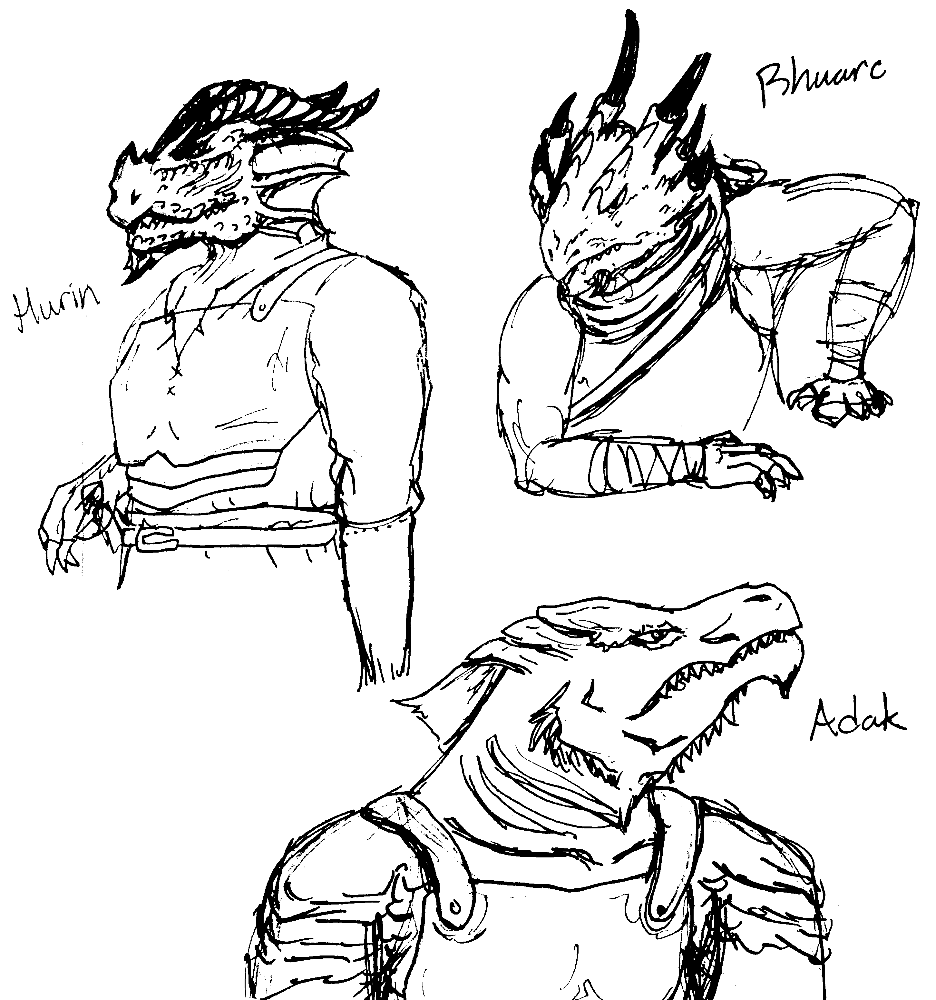

# D&D Infinity

Practicing Domain-Driven Design (DDD) using 5e Dungeons & Dragons (D&D).

## What is D&D Infinity?

This project is a fun side project with the purpose of learning how to build a scalable, maintainable codebase
from scratch. I chose D&D as the model of choice because of my relatively deep understanding of the domain itself.
Of course, I may find that I have some underlying misunderstandings along the way. :)

A good project to start is a D&D Beyond replica - a website where you can create and maintain your
D&D character. This allows me to explore different frameworks and libraries out in the WWW, and also learn
how to integrate these tools together.

Of course, I don't plan to make money off this project - this project is here simply to learn. :)

## Why XYZ technology?

This project is currently written in Python 3.5. I'm writing this in Python for its flexibility to prototype
while modelling (hashmaps are great), and also because I just want to practice Python.

I chose Flask as the heart of the web application because I can quickly create a web application with one language.
Later, Javascript may be added into the project to enhance the UI experience.

## Goals

### Domain goals
* Build a nicely-modelled player character (PC)
* Build a nicely-modelled monster
* Build a character sheet generator to a PDF
* Build an initiative tracker
* Build a PC creation module

### Tech goals
* Learn Python
* Learn MongoDB or a relational database
* Learn Flask with a side of Javascript
* Learn how to fit and use this in a 7" touchscreen

## The Cast of D&D Infinity

In order to showcase the races and classes of Dungeons & Dragons, there will be a cast of characters
that will test and demonstrate the project.

* Eladithas, the elf totem barbarian
* Gosbon, the halfling lore bard
* Tamiphi, the gnome knowledge cleric of Ioun
* Tralin, the gnome druid, Circle of the Moon
* Hurin, the dragonborn champion
* Lok, the human open hand monk
* Rohan, the half-orc paladin, devoted of Ilmater
* Dorian, the dwarf hunter
* Fethri, the tiefling mastermind
* Traskan, the copper dragonborn sorcerer of black dragon magic
* Rajar, the half-elf warlock, servant of the Lifebender
* Dean, the human evocation wizard

For the sake of making the project more awesome, I've added a picture of the dragonborn squad.

