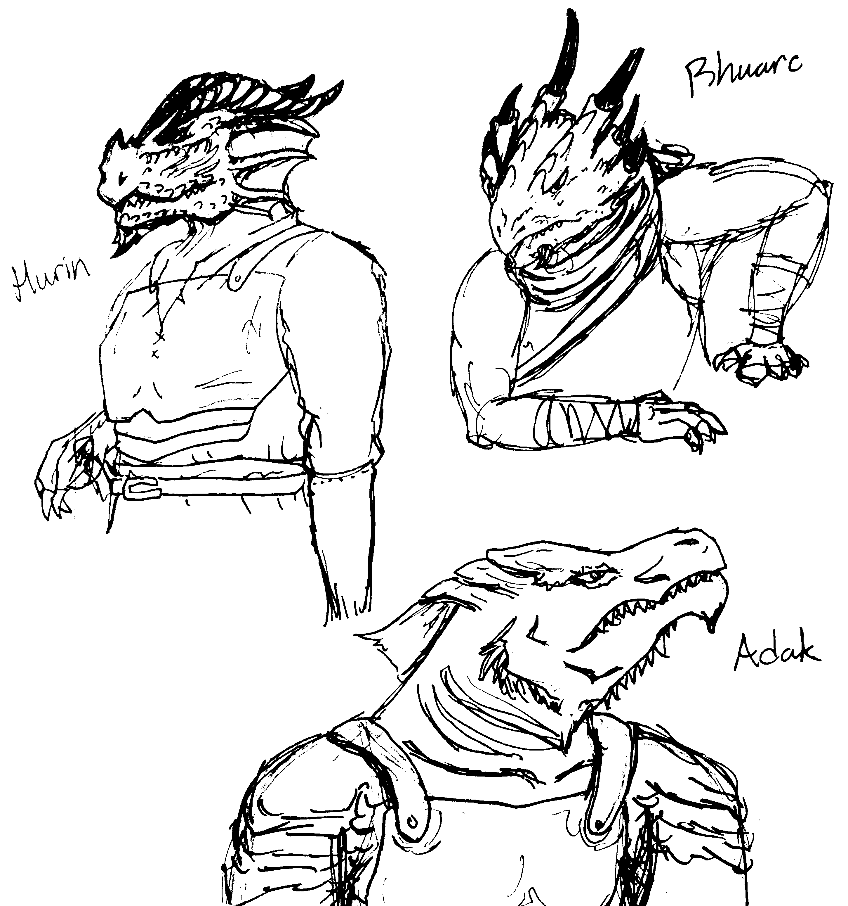

# Practicing DDD with D&D

Practicing Domain-Driven Design (DDD) using 5e Dungeons & Dragons (D&D) as the domain, AKA try to replicate D&D Beyond.

This project is currently written in Python 3.5. I'm writing this in Python for its flexibility to prototype while modelling, and also because I just want to practice Python.

## Project hit list
* Flesh out equipment
* Start adding combat-related stuff
* Flesh out the spellcasting stuff
* Create higher level classes to test aggregations
* Figure out how to factor traits into stats (i.e. dwarven toughness -> more HP)
* Add feats

## Domain goals
* Build a nicely-modelled player character (PC)
* Build a nicely-modelled monster
* Build a character sheet generator (either to a PDF or to website)
* Build an initiative tracker
* Build a PC creation module

# Tech goals
* Learn Python
* Learn MongoDB or a relational database
* Learn Flask with a side of Javascript
* Learn how to fit and use this in a 7" touchscreen

